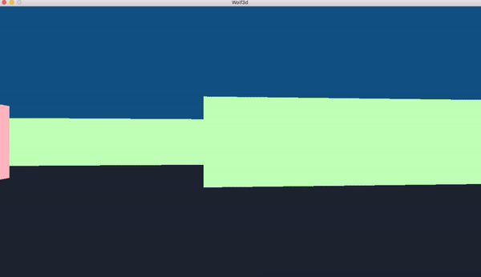

# Wolf3D
3rd project of [42 School](https://www.42.fr) Computer Graphics Branch.

## Description

The goal is to create a basic version of the 1992 Wolfenstein 3D video game.

It is a first approch of the Raycasting method.

## Features

- Turn lef or right
- Go forward or backward
- Walls collision

## Usage

```
$> make
$> ./wolf3d
```
## Keys

<table width="100%">
<thead>
<tr>
<td width="40%" height="60px" align="center" cellpadding="0">
<strong>Description</strong>
</td>
<td width="10%" align="center" cellpadding="0">
<span style="width:70px">&nbsp;</span><strong>Key(s)</strong><span style="width:50px">&nbsp;</span>
</td>
</tr>
</thead>
<tbody>
<tr>
<td valign="top" height="30px">Exit the program</td>
<td valign="top" align="center"><kbd>&nbsp;esc&nbsp;</kbd></td>
</tr>
<tr>
<td valign="top" height="30px">Return to the beginning of the maze</td>
<td valign="top" align="center"><kbd>&nbsp;return&nbsp;</kbd></td>
</tr>
<tr>
<td valign="top" height="30px">Move left or right</td>
<td valign="top" align="center"><kbd>&nbsp;◄&nbsp;</kbd> <kbd>&nbsp;►&nbsp;</kbd></td>
</tr>
<tr>
<td valign="top" height="30px">Move forward or backward</td>
<td valign="top" align="center"><kbd>&nbsp;▲&nbsp;</kbd> <kbd>&nbsp;▼&nbsp;</kbd></td>
</tr>
</tbody>
</table>

## Output

